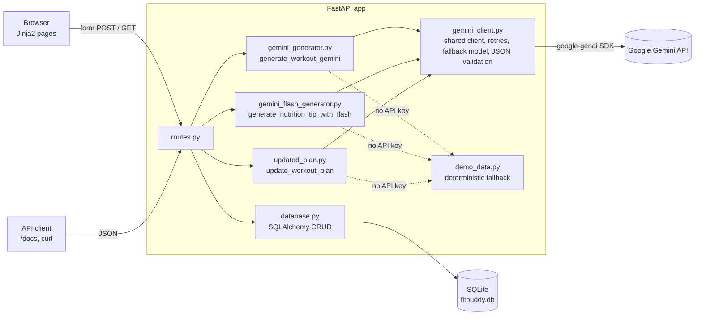
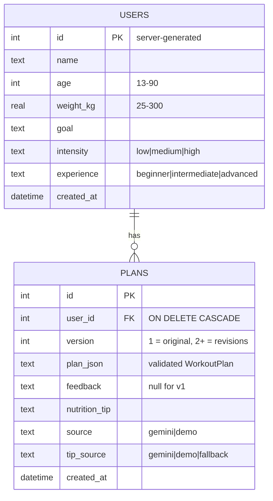
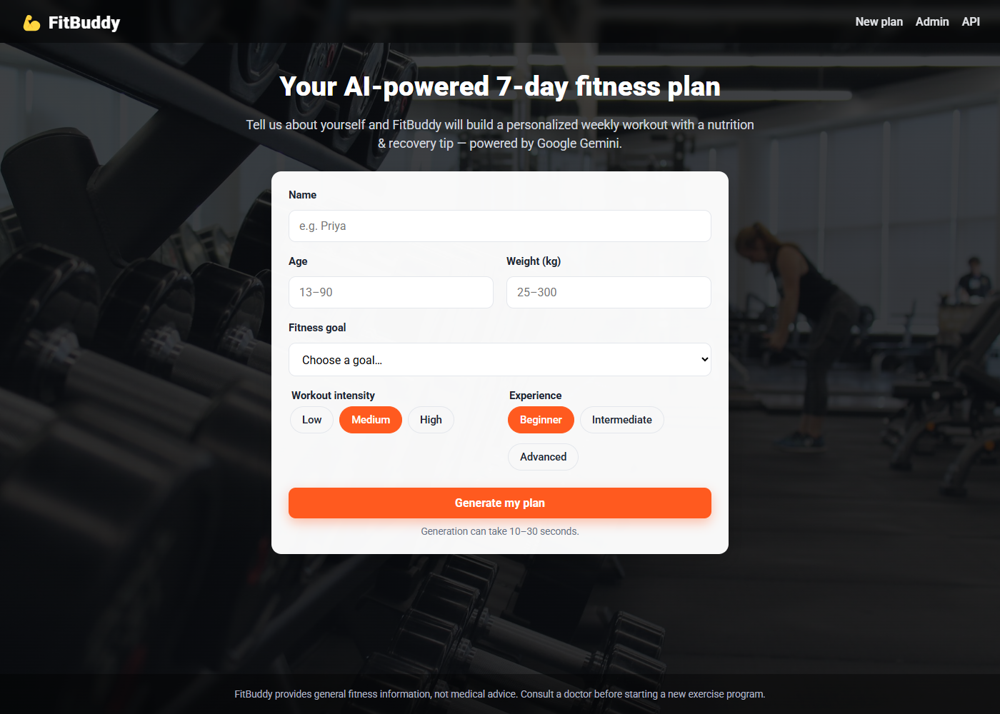
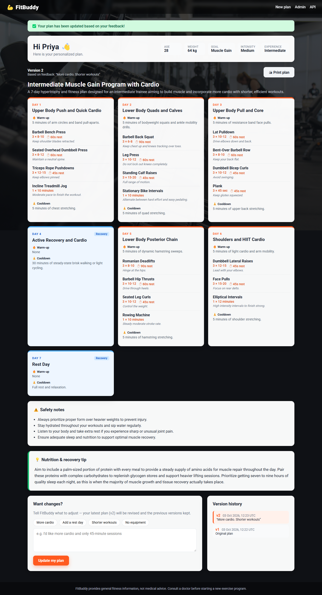
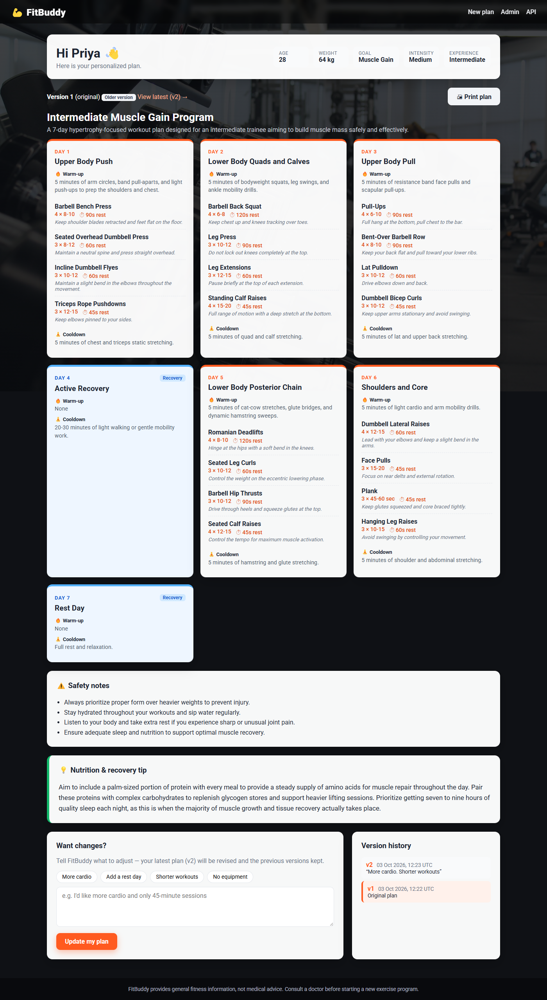
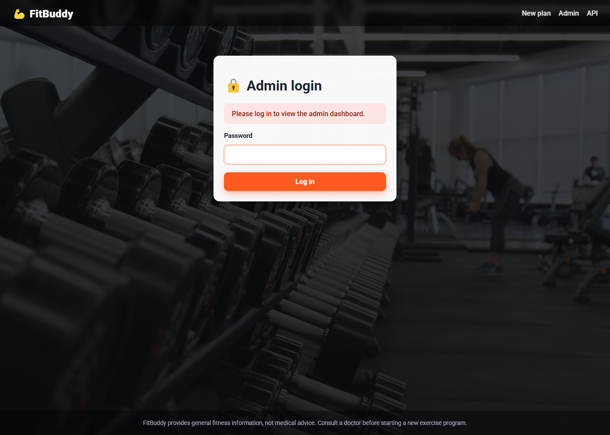
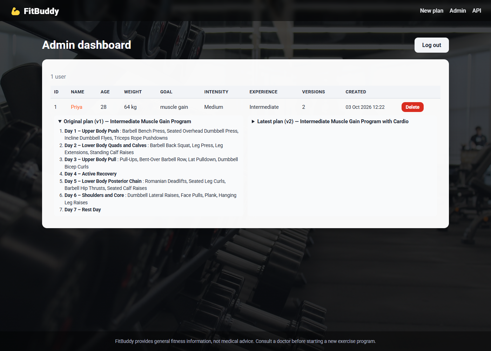
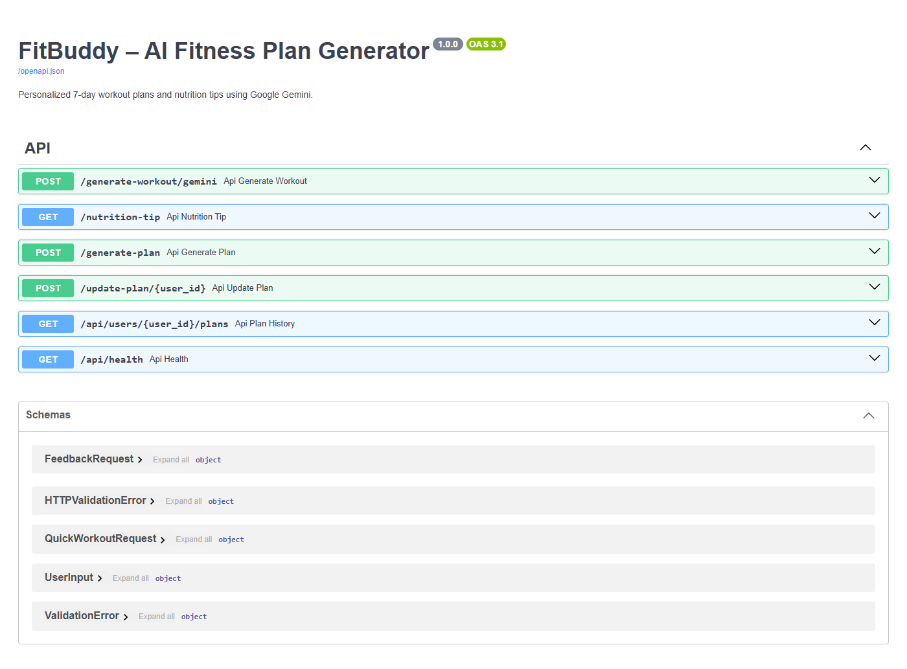
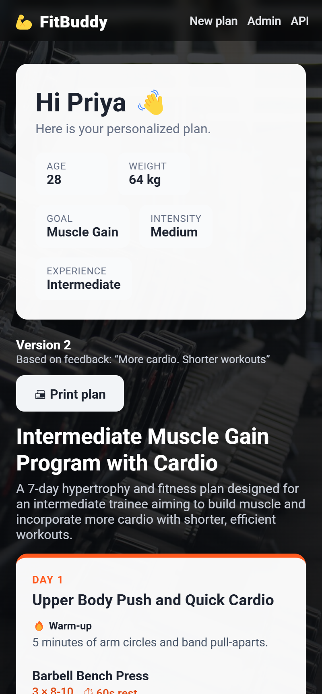

# 💪 FitBuddy - AI Fitness Plan Generator using Gemini Models

**Team ID: 4 - Sharukesh A, Sriram T.G, Mohan S, Jaitheerth**

SmartInternz, Google Cloud Generative AI track

## Project phases

| # | Phase | Documents |
|---|---|---|
| 1 | [Brainstorming & Ideation](./1.%20Brainstorming%20%26%20Ideation/) | Brainstorming & Idea Prioritization, Define Problem Statements, Empathy Map |
| 2 | [Requirement Analysis](./2.%20Requirement%20Analysis/) | Customer Journey Map, Data Flow Diagram, Solution Requirements, Technology Stack |
| 3 | [Project Design Phase](./3.%20Project%20Design%20Phase/) | Problem-Solution Fit, Proposed Solution, Solution Architecture |
| 4 | [Project Planning Phase](./4.%20Project%20Planning%20Phase/) | Project Planning |
| 5 | [Project Development Phase](./5.%20Project%20Development%20Phase/) | Code-Layout, Readability and Reusability, Coding & Solution, No. of Functional Features Included in the Solution |
| 6 | [Project Testing](./6.Project%20Testing/) | Performance Testing |
| 7 | [Project Documentation](./7.Project%20Documentation/) | FitBuddy Project Documentation, Project Executable Files |
| 8 | [Project Demonstration](./8.Project%20Demonstration/) | Communication, Demonstration of Proposed Features, Project Demo Planning, Scalability & Future Plan, Team Involvement in Demonstration |

The application source is at the repository root (`app/`, `tests/`, `reports/`, `screenshots/`). See the
documentation below.

---

FitBuddy is a FastAPI web app that generates a **personalized 7-day workout plan** and a
**nutrition/recovery tip** with Google Gemini, lets users **revise the plan with feedback**
while keeping the full version history, and gives admins a dashboard to review and delete users.


---

## Features

| Scenario | What it does |
|---|---|
| **1. Generate plan** | Enter name, age, weight, goal, intensity and experience to get a structured 7-day plan. Each day has a focus, a warm-up, exercises (sets x reps, rest, form cue) and a cooldown, plus safety notes. |
| **2. Feedback revision** | Feedback such as "more cardio" or "add rest days" revises the **latest** version. Every version is kept (v1, v2, ...), and older versions can be viewed. |
| **3. Nutrition/recovery tip** | A short goal-based tip from a lighter Gemini model, shown under the plan and available at `GET /nutrition-tip`. |
| **4. Admin dashboard** | Password-protected list of all users with their original and latest plans side by side, and delete. |

Also included:
- **Structured JSON output:** Gemini returns JSON that matches a Pydantic schema, and the app validates it before rendering cards. Raw markdown is not shown.
- **Personalized prompts:** age, weight, goal, intensity and experience all go into the prompt, with extra safety rules for teens, older adults and heavier users.
- **Safe failures:** AI errors show a friendly message (HTTP 502), and error text is not saved as a plan.
- **Prompt-injection hardening:** feedback and the free-text goal are wrapped in delimiters with angle brackets neutralized and treated as data, not instructions. Feedback is capped at 500 characters.
- **Demo mode:** with no API key, the app runs fully on deterministic built-in plans and shows a "Demo mode" badge.
- **Responsive, printable UI:** Jinja2 templates with a gym background, Roboto font and print CSS ("Print plan").

## Tech stack

Python 3.11+, FastAPI, Uvicorn, Jinja2, SQLite + SQLAlchemy 2.x, Google Gemini via the
`google-genai` SDK, pytest, Locust

| Role | Env var | Default model |
|---|---|---|
| Plan generation + revision ("Pro role") | `GEMINI_WORKOUT_MODEL` | `gemini-3.8-flash` (or `gemini-3.1-pro-preview` if your key has access) |
| Nutrition tips ("Flash role") | `GEMINI_TIP_MODEL` | `gemini-3.5-flash-lite` |
| Fallback for plans/revisions if the workout model is overloaded (503/429) or not found | `GEMINI_WORKOUT_FALLBACK_MODEL` | `gemini-3.5-flash-lite` (empty = off) |

---

## Architecture



**Request flow for "Generate plan":** validate the form (Pydantic), then generate the plan (workout
model, structured JSON) and the tip (tip model), then, only on success, save the user and plan v1 and
redirect to `/plan/{user_id}`.

## Data model



---

## Setup

### Windows (PowerShell)
```powershell
cd FitBuddy
python -m venv venv
venv\Scripts\activate
pip install -r requirements.txt
copy .env.example .env        # optional: add GEMINI_API_KEY
uvicorn app.main:app --reload
```

### macOS / Linux
```bash
cd FitBuddy
python3 -m venv venv
source venv/bin/activate
pip install -r requirements.txt
cp .env.example .env          # optional: add GEMINI_API_KEY
uvicorn app.main:app --reload
```

Open <http://127.0.0.1:8000>. The API docs are at <http://127.0.0.1:8000/docs>.
**Without `.env` or an API key, the app starts in demo mode**, so no configuration is needed to try it.
Get a key at <https://aistudio.google.com/apikey>.

### Environment variables

| Variable | Default | Purpose |
|---|---|---|
| `GEMINI_API_KEY` | *(empty)* | Gemini API key. `GOOGLE_API_KEY` is also accepted. Empty means demo mode. |
| `GEMINI_WORKOUT_MODEL` | `gemini-3.8-flash` | Model for plan generation and revision |
| `GEMINI_TIP_MODEL` | `gemini-3.5-flash-lite` | Model for nutrition tips |
| `GEMINI_WORKOUT_FALLBACK_MODEL` | `gemini-3.5-flash-lite` | Tried once if the workout model is overloaded or not found. Empty disables it. |
| `DEMO_MODE` | `false` | `true` forces demo mode even when a key is set |
| `ADMIN_PASSWORD` | `admin123` | Admin dashboard password (**change this**; a warning is logged while it is `admin123`, and empty disables admin) |
| `SECRET_KEY` | *(empty)* | Signs the admin session cookie. If empty or `change-me`, a random key is generated at startup (admin sessions reset on restart) |
| `DATABASE_URL` | `sqlite:///./fitbuddy.db` | SQLAlchemy database URL |
| `GEMINI_TIMEOUT_SECONDS` | `45` | Timeout for each Gemini call (also capped by the request time budget below) |

**Request time budget.** `GEMINI_TIMEOUT_SECONDS` (45 s) is the timeout for a single Gemini call.
Plan generation and revision, including the one retry, one extra attempt for an invalid plan and the fallback model, share a total budget
of about 50 s. The nutrition tip has a budget of about 10 s with no retry; if it fails, a built-in tip is
used instead. A form submit therefore takes at most about 60 s.

---

## Routes

### HTML pages
| Method | Path | Description |
|---|---|---|
| GET | `/` | Input form |
| POST | `/generate-workout` | Validate, generate, save v1, then redirect to `/plan/{user_id}` |
| GET | `/plan/{user_id}` | Latest plan as day cards, tip, feedback form and version history |
| GET | `/plan/{user_id}/version/{v}` | View an older version |
| POST | `/submit-feedback` | Revise the latest plan, save a new version, then redirect with `?updated=1` |
| GET/POST | `/admin/login` | Admin login (signed, HTTP-only cookie) |
| GET | `/view-all-users` | Admin dashboard |
| POST | `/admin/delete-user/{user_id}` | Delete a user and all their plans (admin only) |
| GET | `/admin/logout` | Log out |

### JSON API (see `/docs`)
| Method | Path | Body / query | Returns |
|---|---|---|---|
| POST | `/generate-workout/gemini` | `{goal, intensity, age?, weight?, experience?}` | `{model, workout_plan}`, nothing saved |
| GET | `/nutrition-tip?goal=...&age=...` | | `{goal, nutrition_tip}` |
| POST | `/generate-plan` | `{name, age, weight_kg, goal, intensity, experience}` | `{user_id, version, workout_plan, nutrition_tip}` |
| POST | `/update-plan/{user_id}` | `{feedback}` | `{user_id, version, updated_plan}` |
| GET | `/api/users/{user_id}/plans` | | User info and full version history |
| GET | `/api/health` | | `{status, db, gemini_configured, demo_mode, models}` |

Status codes: `422` validation error, `404` not found, `502` AI failure, `401` admin required.

---

## Testing

```bash
pytest -q                     # 86 test functions (120 cases), demo mode, temporary DB
```
The tests cover the home page, generation and redirect to a 7-day plan, feedback creating v2
while keeping v1, revisions building on the latest version, validation (422), the admin
login, delete and cascade, every JSON endpoint, health and `/docs`. A mocked Gemini transport
also checks that age and weight reach the prompt, that feedback and the goal are delimited, that failures
do not save error text, that invalid model JSON or plans breaking the rules (days 1-7, a rest day,
positive sets/rest) are rejected, that real SDK errors (404, 401/403, 429, 503, timeouts) are
handled, and that retries and fallback stay within the time budget. `test_security.py` covers the
admin key and disabled-admin cases. `test_demo_safety.py` checks demo plans and revisions for a few
representative users (a teen beginner, a 65-year-old, a 120 kg lifter, an intermediate adult):
age and weight rules, injury and negated feedback, no-equipment swaps and sensible units.

### Load test (Locust)
```bash
DEMO_MODE=true uvicorn app.main:app --port 8000          # terminal 1
locust -f tests/locustfile.py --headless -u 50 -r 10 -t 60s \
  --host http://127.0.0.1:8000 --csv reports/perf --html reports/perf.html   # terminal 2
```
Result (50 users, 60 s, demo mode): **1,457 requests, 0 failures, 5.4 ms average, 3 ms median, 77 ms max, 24.5 req/s.**
Server resource usage (launcher + server combined): CPU 4.2% average, 13.9% peak of one core (0.53% and 1.74% of the
8-core system), memory about 81 MB (about 1% of RAM). `python scripts/resource_monitor.py` runs the same load test
while sampling CPU and memory into `reports/resource_usage.csv`.
All targets met (average < 2 s, max < 5 s, errors < 1%). See `reports/perf_summary.md` and `reports/perf.html`.
The real-Gemini timing runs (plan, revision and tip latency, and the 503 fallback) are recorded in the same file.

---

## Screenshots

| | |
|---|---|
| Home  | Plan result  |
| Feedback applied (v2)  | Older version (v1)  |
| Admin login  | Admin dashboard  |
| API docs  | Mobile  |

---

## Project structure
```
FitBuddy/
├── app/
│   ├── main.py                    # FastAPI app, static files, startup (creates tables)
│   ├── config.py                  # .env loading
│   ├── routes.py                  # HTML + JSON routes
│   ├── database.py                # engine, models, CRUD helpers
│   ├── schemas.py                 # Pydantic: UserInput, FeedbackRequest, WorkoutPlan
│   ├── gemini_client.py           # shared genai.Client, retries, JSON validation
│   ├── gemini_generator.py        # generate_workout_gemini()
│   ├── gemini_flash_generator.py  # generate_nutrition_tip_with_flash()
│   ├── updated_plan.py            # update_workout_plan()
│   ├── demo_data.py               # deterministic fallback
│   ├── templates/                 # base, index, result, _plan, all_users, admin_login, error
│   └── static/                    # css/style.css, images/gym-bg.jpg
├── tests/                         # test_routes.py, test_security.py, test_ai_hardening.py,
│                                  # test_demo_safety.py, conftest.py, locustfile.py
├── scripts/                       # resource_monitor.py (load test + CPU/memory sampling)
├── reports/                       # Locust results
├── screenshots/
├── .env.example, .gitattributes, requirements.txt, pytest.ini, README.md
```

## Known limitations

- Real Gemini latency (measured 2026-10-03, see `reports/perf_summary.md`): a plan takes about 14 s on
  `gemini-3.8-flash` and about 5 s on `gemini-3.5-flash-lite`, and a tip about 1 s. When the primary model
  is overloaded (503), the fallback path takes 17-20 s end to end.
- Plan generation with a real model takes several seconds, and requests are synchronous (no streaming or background jobs).
- User IDs are sequential integers and there are no end-user accounts, so anyone who knows or guesses a
  plan URL or user id (`/plan/{id}`, `/api/users/{id}/plans`, `/update-plan/{id}`) can view or revise that
  plan. That is fine for a demo; production would use accounts or unguessable IDs.
- Two feedback submissions for the same user at the exact same moment can, rarely, produce a duplicate
  version number (there is no unique constraint on `user_id` + `version`).
- Admin auth is a single shared password with a signed cookie, with no CSRF tokens or rate limiting. That is fine for a demo, not for production.
- SQLite with a single Uvicorn worker. Use Postgres and multiple workers to scale.
- Demo-mode revisions are simple keyword rules (cardio, rest, shorter, no equipment, yoga, less jumping, injury or pain, more training). Feedback that matches no rule leaves the plan unchanged and says so.
- FitBuddy gives general fitness information, **not medical advice**.

## Credits

Background photo from Unsplash (Unsplash License): `https://images.unsplash.com/photo-1534438327276-14e5300c3a48`.
